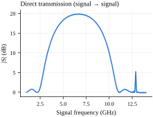
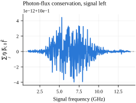
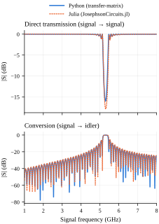
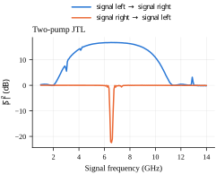

# Traveling Wave Parametric Devices

Simulation and analysis toolkit for traveling-wave Josephson parametric
amplifiers and converters (TWPA/TWPC) based on a lumped-element and discrete transmission line model using transfer-matrices to extract the network S-parameters. This software was developed in the LPENS-Quantic laboratory.

## Installation

Dependencies are managed with [uv](https://docs.astral.sh/uv/), which
installs the right Python version for you and keeps everyone on the exact
same package set via [`uv.lock`](uv.lock).

### 1. Install uv

**Linux / macOS**

```bash
curl -LsSf https://astral.sh/uv/install.sh | sh
```

**Windows** (PowerShell)

```powershell
powershell -ExecutionPolicy ByPass -c "irm https://astral.sh/uv/install.ps1 | iex"
```

### 2. Set up the project

Same commands on every platform — uv creates and manages `.venv` for you and
installs the exact Python version pinned in
[`.python-version`](.python-version):

```bash
git clone https://github.com/steltze/Josephson-Traveling-Wave-Parametric-Devices.git
cd Josephson-Traveling-Wave-Parametric-Devices
uv sync
```

Then run anything with `uv run`, e.g. `uv run pytest`, without manually
activating the virtual environment. If you'd rather activate it directly:

```bash
# Linux/macOS
source .venv/bin/activate
```

```powershell
# Windows (PowerShell)
.venv\Scripts\Activate.ps1
```

If PowerShell refuses to run the activation script (`running scripts is
disabled on this system`), that's its default script-execution policy —
either run `uv run <command>` instead of activating, or allow it for the
current session only:

```powershell
Set-ExecutionPolicy -Scope Process -ExecutionPolicy Bypass
```

Optional extras (also installable individually, e.g. `uv sync --extra numba`):

```bash
uv sync --all-extras   # numba backend, dashboard, docs
```

- `numba` — JIT-compiled backend for the ABCD/S-matrix solvers
- `dashboard` — interactive Streamlit S-parameter viewer
- `docs` — Sphinx documentation build

### Without uv

If you'd rather not install uv, plain `pip` works too — `pyproject.toml` is
the source of truth, `uv.lock` is uv-specific:

```bash
# Linux/macOS
python3 -m venv .venv
source .venv/bin/activate
pip install ".[dashboard,numba]"
```

```powershell
# Windows (PowerShell)
py -m venv .venv
.venv\Scripts\Activate.ps1
pip install ".[dashboard,numba]"
```

## Documentation

See [`docs/getting_started.md`](docs/getting_started.md) for a quickstart
and the full API reference.

## Example results

A few figures generated by the [`examples/`](src/examples) scripts,
giving a sense of what the simulator can model and how it's been validated.

### Baseline transmission spectrum

<p align="center">
  
  
</p>

The standalone signal→signal transmission spectrum for the same
three-wave-mixing configuration used in the JosephsonCircuits.jl
comparison below (ks_state = [-1, 0, 1], 320 cells, 13.21 GHz pump,
Φ_dc/Φ0 = 1/3), shown on its own as a simple reference curve. Next to
it, the corresponding photon-flux conservation check: the weighted sum
$\sum_i \eta_i |S_{i,0}|^2$ over all signal/idler/pump ports driven
from the left-signal port, which must equal 1 for a lossless,
unitary S-matrix — confirming the transfer-matrix solver conserves
photon flux to numerical precision across the swept band
(`src/examples/julia_comparison.py`).


### Validated against JosephsonCircuits.jl



Direct signal→signal transmission (top) and signal→idler conversion
(bottom) for a 320-cell, flux-pumped Josephson transmission line
(pump at 13.21 GHz, DC flux bias Φ_dc/Φ0 = 1/3), computed two independent
ways: this repo's discrete transfer-matrix solver ("Python") and
[JosephsonCircuits.jl](https://github.com/kpobrien/JosephsonCircuits.jl)
("Julia"), a harmonic-balance Josephson-circuit simulator. The two curves
overlay across the swept band, cross-validating the transfer-matrix
approach against an independently-implemented harmonic-balance solver
(`src/examples/head_to_head_comparison.py`).

### Two independent pump tones on one line



A single 320-cell Josephson transmission line with two independent pump tones (10.0 GHz and 13.2 GHz) at once, each producing its own signal→idler conversion product (idler₁ = signal + pump₁, idler₂ = signal + pump₂). Internally this builds a tensor-product state lattice over both pumps' harmonics rather than the single flat harmonic ladder used for one pump (`examples/multi_pump_jtl_example.py).
### Adiabatic pump-strength ramp


Transmission through a 1627-cell counter-pumped JTL with an adiabatically decreasing pump velocity, which shifts the phase-matching point for different conversion processes along the line and merges their stopbands into one continuous gap of larger bandwidth and roughly constant attenuation.
### Spurious slot-mode coupling


`JTLDiscreteSlotMode` adds a stray slot-line resonance, coupled into
each unit cell through a coupling capacitance, to model how a parasitic
package/chip-mode resonance perturbs the JTL's conversion and
transmission spectra. This case has the slot mode's cutoff at 5× the
line's own cutoff frequency and a coupling capacitance 0.1× the slot
mode's self-capacitance; it's one point from a larger sweep over both
ratios used to map out where such spurious couplings matter
(`src/examples/slot_mode_sweep.py`).


